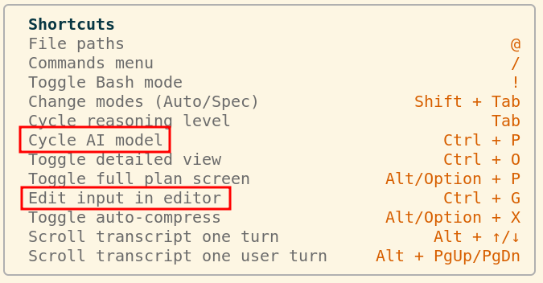

# Factory.ai Droid CLI (rNoz tweaks)

<div align="center">

> Always-fresh, automated packaging for [Factory.ai CLI](https://app.factory.ai) (`droid`) featuring zero-waste deterministic session titling, cross-harness keybindings, hardware-optimal packaging, and automated release security checks.

[](https://github.com/rNoz/factory-ai-droid-cli-rnoz/actions/workflows/aur-sync.yml)
[](https://aur.archlinux.org/packages/factory-ai-droid-cli-rnoz-bin)
[](https://github.com/rNoz/factory-ai-droid-cli-rnoz/actions/workflows/aur-sync.yml)
[](LICENSE)
[](#supported-architectures--platforms)
[](https://python.org)
[](#tested-releases)

</div>

---

## Why this exists

1. **Zero Titling Token Waste (& Noise)**: Factory CLI by default fires an unconfigurable background LLM call (Claude Haiku 4.5) on the first prompt of every interactive session, which generates noise in monitoring and harness proxy tools (e.g., 99.999% $requested-model <0.1% haiku-4.5). Furthermore, this consumed around ~500 input and ~25 output credits per session. This package enforces instant, local deterministic titling—saving API credits and eliminating initial latency while keeping terminal tab titles and session history logs intact. **AUR package: optional feature, asked interactively.**
2. **Muscle-Memory Keybindings**: The interactive keymap rotates editor, model-cycle, and queued-message shortcuts to `Ctrl-G`, `Ctrl-P`, and `Ctrl-I`, respectively. The patch refuses unknown or conflicting upstream layouts (see [Muscle-Memory Keybindings](#muscle-memory-keybindings)). **AUR package: optional feature, asked interactively.**
3. **Hardware-Optimal Lean Binary**: Unlike generic packages that either force AVX2 (crashing older/virtualized CPUs with `SIGILL`) or ship bloated multi-binary bundles, `factory-ai-droid-cli-rnoz-bin` inspects the host CPU at build/package time and installs **only one single binary** (`/usr/lib/factory/droid`). Modern CPUs receive the AVX2-optimized build; legacy/VM/sandbox CPUs receive the baseline build. Package size varies with upstream releases; only one architecture-specific binary is installed, with no runtime wrapper overhead.
4. **Always Fresh & Autonomous**: Automated CI checks Factory AI upstream releases every few hours, validates patches against multiple releases in an official Arch Linux container, and publishes updates with zero manual intervention.
5. **Supply Chain Security & Linters**: Every build is scanned with [aurscan](https://github.com/manticore-projects/aurscan) (release and SHA-256 pinned in CI) to guarantee clean, non-malicious packaging scripts. Code is strictly validated with `flake8`, `shellcheck`, and `shfmt`.
6. **Clean & Lean Packaging**: Only bundles what `droid` actually requires. Includes bundled `ripgrep` with optional fallback to system `ripgrep`. Upstream binaries are fetched dynamically during installation and validated with fail-closed SHA-256 checks.

---

## Muscle-Memory Keybindings

<div align="center">



<table align="center">
  <thead>
    <tr><th>Action</th><th>Upstream</th><th>This package</th></tr>
  </thead>
  <tbody>
    <tr><td>Open input in editor</td><td><code>Ctrl-P</code></td><td><code>Ctrl-G</code></td></tr>
    <tr><td>Cycle AI model</td><td><code>Ctrl-N</code></td><td><code>Ctrl-P</code></td></tr>
    <tr><td>Pull queued message</td><td><code>Ctrl-G</code></td><td><code>Ctrl-I</code></td></tr>
  </tbody>
</table>

</div>

Applied in place by `patches/patch_keybindings.py` at identical byte length; any unknown or partially patched layout aborts the patch. Interactive `makepkg` and `scripts/patch-macos.sh` ask before each patch (default `[Y]`); non-interactive runs apply both. The macOS script smoke-tests `droid --version` after all selected patches and asks before removing its backup (default `[Y]`).

The runtime registry is patched along with the visible keymap, so `Ctrl-P` is
no longer retained as the old editor descriptor and `Ctrl-I` resolves through
the same matcher path as the direct dispatch. `Ctrl-I` requires a terminal
that forwards modified keys using Kitty/CSI-u (for example Alacritty with
tmux `extended-keys on`); legacy terminals encode it as `Tab`.

---

## Supported Architectures & Platforms

| Platform | Architecture | Upstream Binary Stream | Packaging Behavior | Testing Status |
| :--- | :--- | :--- | :--- | :--- |
| **Arch Linux** | `x86_64` (AVX2 supported) | `linux/x64/droid` | Installs AVX2-optimized single binary | **Verified** (CI & Arch container) |
| **Arch Linux** | `x86_64` (No AVX2 / VM) | `linux/x64-baseline/droid` | Installs baseline single binary (zero `SIGILL`) | **Verified** (CI & Arch container) |
| **Arch Linux** | `aarch64` | `linux/arm64/droid` | Installs native ARM64 single binary | Build verified |
| **macOS** | Apple Silicon (`arm64`) | Official Homebrew / `droid update` | In-place patch with collision-resistant backup | **Verified directly on macOS** |
| **macOS** | Intel (`x86_64`) | Official Homebrew / `droid update` | In-place patch with collision-resistant backup | *Not verified* |

> **Testing Scope**: Arch Linux packaging, AVX2 execution, non-AVX2 baseline fallback, and byte-exact patch replacement are automated in CI. Apple Silicon macOS patching has also been verified directly after `droid update`; Intel macOS remains unverified.

*Note: Maintainers and automated builders can explicitly force a variant via `DROID_ARCH_VARIANT=baseline` or `DROID_ARCH_VARIANT=avx2` when invoking `makepkg`.*

---

## Installation

### Arch Linux (AUR / `makepkg`)

Install via your preferred AUR helper:

```bash
yay -S factory-ai-droid-cli-rnoz-bin
```

Or build manually from source:

```bash
git clone https://github.com/rNoz/factory-ai-droid-cli-rnoz.git
cd factory-ai-droid-cli-rnoz
./scripts/build-local.sh -si
```

*Provides and conflicts with `droid`, `factory-cli`, and `factory-cli-bin`.*

### macOS

After each `droid update`, rerun the patcher because the updater replaces the binary:

Run the standalone patcher against an existing Factory CLI installation:

```bash
git clone https://github.com/rNoz/factory-ai-droid-cli-rnoz.git
cd factory-ai-droid-cli-rnoz
./scripts/patch-macos.sh
```

*Locates `droid`, resolves symlinks, creates collision-resistant backups (`droid.bak-*`), applies byte-safe patches, validates execution, and cleans up backups after successful non-interactive runs.*

---

## Repository Structure

```text
├── PKGBUILD                              # Arch Linux package specification (hardware-optimal)
├── .SRCINFO                              # Generated AUR package metadata
├── patches/
│   ├── patch_title.py                    # Core context-bounded byte-exact patch engine
│   └── patch_keybindings.py              # Isolated fail-closed keymap rotation
├── docs/images/factory-keybindings-remap.png # Documentation only; never packaged
├── factory-ai-droid-cli-rnoz-bin.install # Pacman post-install notice
├── LICENSE                               # Apache-2.0 License
├── scripts/
│   ├── patch-macos.sh                    # Standalone macOS patcher with backup rotation
│   ├── build-local.sh                    # Temporary-workspace local Arch package build
│   ├── build-in-container.sh             # Isolated Arch Linux container build script
│   └── fetch-changelog.py                # Upstream release notes scraper
└── tests/
    ├── test_versions.py                  # Fetch/retest title and keybinding patches across releases
    ├── test_keybindings.py               # Offline keymap rotation and help-text fixtures
    └── simulate_breakage.py              # Fail-closed breakage simulation suite
```

---

## Verification and engineering

See [Verification and testing](docs/verification.md) and
[Engineering and safety](docs/engineering.md).

### Tested releases

Maintainer release and rebuild procedures are documented in
[`docs/maintainer-release.md`](docs/maintainer-release.md).

<div align="center">

<!-- tested-releases:start -->
<table align="center">
  <thead>
    <tr><th>linux x86_64 avx2</th><th>linux x86_64</th></tr>
  </thead>
  <tbody>
    <tr><td><a href="https://github.com/rNoz/factory-ai-droid-cli-rnoz/actions/workflows/aur-sync.yml"></a></td><td><a href="https://github.com/rNoz/factory-ai-droid-cli-rnoz/actions/workflows/aur-sync.yml"></a></td></tr>
    <tr><td><a href="https://github.com/rNoz/factory-ai-droid-cli-rnoz/actions/workflows/aur-sync.yml"></a></td><td><a href="https://github.com/rNoz/factory-ai-droid-cli-rnoz/actions/workflows/aur-sync.yml"></a></td></tr>
    <tr><td><a href="https://github.com/rNoz/factory-ai-droid-cli-rnoz/actions/workflows/aur-sync.yml"></a></td><td><a href="https://github.com/rNoz/factory-ai-droid-cli-rnoz/actions/workflows/aur-sync.yml"></a></td></tr>
    <tr><td><a href="https://github.com/rNoz/factory-ai-droid-cli-rnoz/actions/workflows/aur-sync.yml"></a></td><td><a href="https://github.com/rNoz/factory-ai-droid-cli-rnoz/actions/workflows/aur-sync.yml"></a></td></tr>
    <tr><td><a href="https://github.com/rNoz/factory-ai-droid-cli-rnoz/actions/workflows/aur-sync.yml"></a></td><td><a href="https://github.com/rNoz/factory-ai-droid-cli-rnoz/actions/workflows/aur-sync.yml"></a></td></tr>
    <tr><td><a href="https://github.com/rNoz/factory-ai-droid-cli-rnoz/actions/workflows/aur-sync.yml"></a></td><td><a href="https://github.com/rNoz/factory-ai-droid-cli-rnoz/actions/workflows/aur-sync.yml"></a></td></tr>
    <tr><td><a href="https://github.com/rNoz/factory-ai-droid-cli-rnoz/actions/workflows/aur-sync.yml"></a></td><td><a href="https://github.com/rNoz/factory-ai-droid-cli-rnoz/actions/workflows/aur-sync.yml"></a></td></tr>
    <tr><td><a href="https://github.com/rNoz/factory-ai-droid-cli-rnoz/actions/workflows/aur-sync.yml"></a></td><td><a href="https://github.com/rNoz/factory-ai-droid-cli-rnoz/actions/workflows/aur-sync.yml"></a></td></tr>
    <tr><td><a href="https://github.com/rNoz/factory-ai-droid-cli-rnoz/actions/workflows/aur-sync.yml"></a></td><td><a href="https://github.com/rNoz/factory-ai-droid-cli-rnoz/actions/workflows/aur-sync.yml"></a></td></tr>
    <tr><td><a href="https://github.com/rNoz/factory-ai-droid-cli-rnoz/actions/workflows/aur-sync.yml"></a></td><td><a href="https://github.com/rNoz/factory-ai-droid-cli-rnoz/actions/workflows/aur-sync.yml"></a></td></tr>
    <tr><td><a href="https://github.com/rNoz/factory-ai-droid-cli-rnoz/actions/workflows/aur-sync.yml"></a></td><td><a href="https://github.com/rNoz/factory-ai-droid-cli-rnoz/actions/workflows/aur-sync.yml"></a></td></tr>
    <tr><td><a href="https://github.com/rNoz/factory-ai-droid-cli-rnoz/actions/workflows/aur-sync.yml"></a></td><td><a href="https://github.com/rNoz/factory-ai-droid-cli-rnoz/actions/workflows/aur-sync.yml"></a></td></tr>
    <tr><td><a href="https://github.com/rNoz/factory-ai-droid-cli-rnoz/actions/workflows/aur-sync.yml"></a></td><td><a href="https://github.com/rNoz/factory-ai-droid-cli-rnoz/actions/workflows/aur-sync.yml"></a></td></tr>
    <tr><td><a href="https://github.com/rNoz/factory-ai-droid-cli-rnoz/actions/workflows/aur-sync.yml"></a></td><td><a href="https://github.com/rNoz/factory-ai-droid-cli-rnoz/actions/workflows/aur-sync.yml"></a></td></tr>
    <tr><td><a href="https://github.com/rNoz/factory-ai-droid-cli-rnoz/actions/workflows/aur-sync.yml"></a></td><td><a href="https://github.com/rNoz/factory-ai-droid-cli-rnoz/actions/workflows/aur-sync.yml"></a></td></tr>
    <tr><td><a href="https://github.com/rNoz/factory-ai-droid-cli-rnoz/actions/workflows/aur-sync.yml"></a></td><td><a href="https://github.com/rNoz/factory-ai-droid-cli-rnoz/actions/workflows/aur-sync.yml"></a></td></tr>
    <tr><td><a href="https://github.com/rNoz/factory-ai-droid-cli-rnoz/actions/workflows/aur-sync.yml"></a></td><td><a href="https://github.com/rNoz/factory-ai-droid-cli-rnoz/actions/workflows/aur-sync.yml"></a></td></tr>
    <tr><td><a href="https://github.com/rNoz/factory-ai-droid-cli-rnoz/actions/workflows/aur-sync.yml"></a></td><td><a href="https://github.com/rNoz/factory-ai-droid-cli-rnoz/actions/workflows/aur-sync.yml"></a></td></tr>
  </tbody>
</table>
<!-- tested-releases:end -->

</div>

## Contributing

Proposals, suggestions, improvements, and pull requests are welcome.

## License

This is an unofficial community package. It is not affiliated with, endorsed
by, or sponsored by Factory AI.

Repository scripts and documentation are Apache-2.0. Downloaded Factory and
ripgrep binaries remain third-party components subject to their respective
licenses and terms. Review the applicable upstream terms before using or
redistributing this package.
